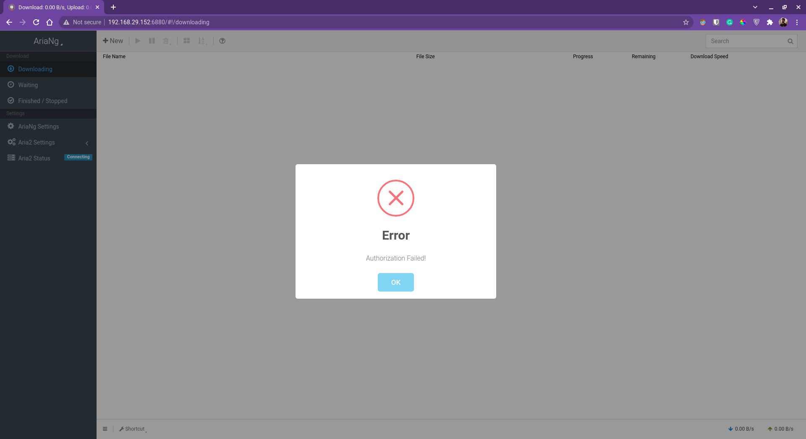
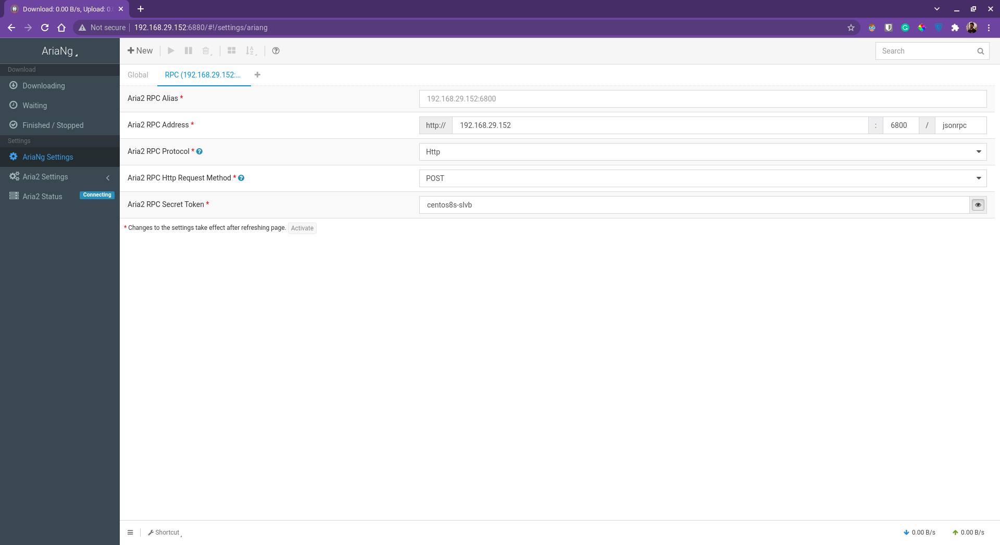
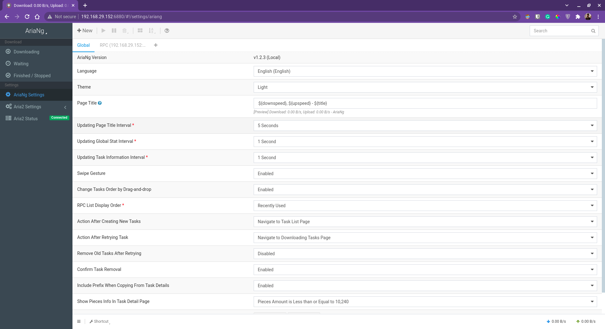

# Setting up Aria2-Pro with AriaNg Docker on CentOS host

> Reference : https://hub.docker.com/r/p3terx/aria2-pro and https://hub.docker.com/r/p3terx/ariang

1. Clone the repo to your local storage and make the `setting-up-aria2pro-with-ariang-docker-on-centos-host` directory your current working directory.
2. Make changes to `prepbook.yml` according to your preferences to reflect the changes in `hostaddr`, `username`, `servlist`, `p3txar2p_conf`, `p3txar2p_data`, `p3txar2p_hostname`, `p3txar2p_rpcp`, `p3txar2p_lspt`, `p3txar2p_rpcspass`, `p3txar2p_lval`, `p3txarng_hostname`, `p3txarng_webp` and `p3txarng_lval` variables.
3. Once done, execute the following command to populate the primary playbook and inventory file.
    ```
    ansible-playbook prepbook.yml -vvv
    ```
4. Fetch the `community.docker` collection from Ansible Galaxy by executing the following command.
    ```
    ansible-galaxy collection install community.docker
    ```
5. Two new files would be generated as a result, so execute the following command to actually start setting up Aria2-Pro with AriaNG Docker.
    ```
    ansible-playbook -i register.ini trapplay.yml -vvv
    ```
6. Once the container is configured and started, open up `http://<ansible_host>:<p3txarng_webp>/` using a web browser of your choice on a device connected to the same network as that of the server.
   
7. Close the error modal and head over to **AriaNg Settings** in the sidebar. In the **RPC (`<ansible_host>`:`<p3txar2p_rpcp>`)** panel, edit the fields as per your preferred variables and refresh the page.
   
8. Once the correct variables are provided, the webclient would be able to connect to Aria2 and be ready to use.
   
