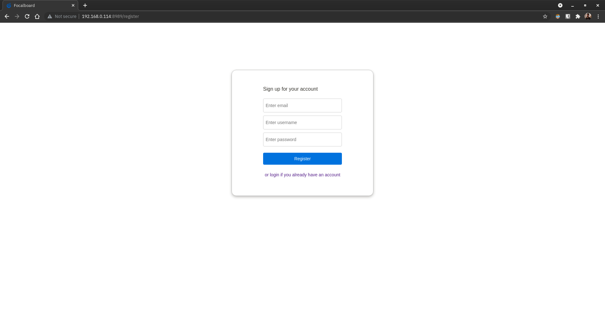

# Setting up FocalBoard Docker on CentOS host

> Reference : https://www.focalboard.com/download/personal-edition/docker/

1. Clone the repo to your local storage and make the `setting-up-focalboard-docker-on-centos-host` directory your current working directory.
2. Make changes to `prepbook.yml` according to your preferences to reflect the changes in `hostaddr`, `username`, `servlist`, `foclbord_hostname`, `foclbord_port` and `foclbord_vers` variables.
3. Once done, execute the following command to populate the primary playbook and inventory file.
    ```
    ansible-playbook prepbook.yml -vvv
    ```
4. Fetch the `community.docker` collection from Ansible Galaxy by executing the following command.
    ```
    ansible-galaxy collection install community.docker
    ```
5. Two new files would be generated as a result, so execute the following command to actually start setting up Focalboard Docker.
    ```
    ansible-playbook -i register.ini trapplay.yml -vvv
    ```
6. Once the container is configured and started, open up `http://<ansible_host>:<foclbord_port>/` (or `http://192.168.0.114:8989/` if nothing was changed) using a web browser of your choice on a device connected to the same network as that of the server.
    
7. Create a new account and log into it to get started with using Focalboard.