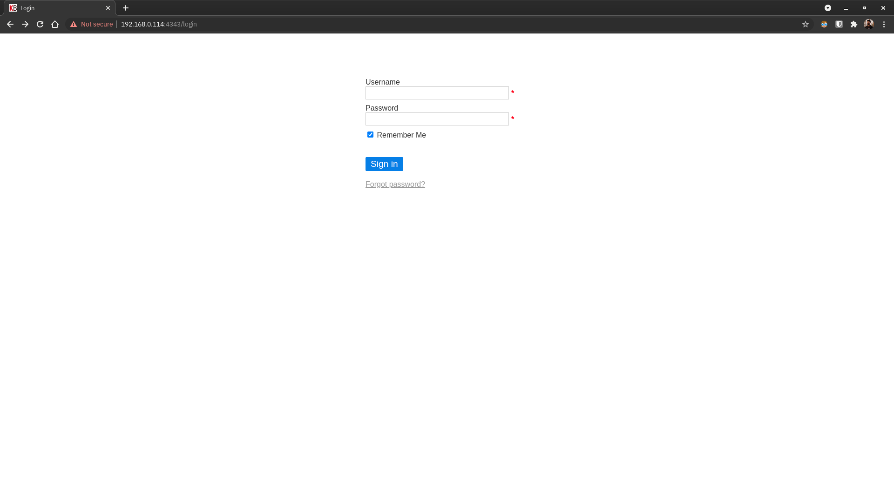

# Setting up Kanboard Docker on CentOS host

> Reference : https://docs.kanboard.org/en/latest/admin_guide/docker.html

1. Clone the repo to your local storage and make the `setting-up-kanboard-docker-on-centos-host` directory your current working directory.
2. Make changes to `prepbook.yml` according to your preferences to reflect the changes in `hostaddr`, `username`, `servlist`, `kanboard_datavolm`, `kanboard_plgnvolm`, `kanboard_ssldvolm`, `kanboard_hostname`, `kanboard_porthttp` and `kanboard_porttlsd` variables.
3. Once done, execute the following command to populate the primary playbook and inventory file.
    ```
    ansible-playbook prepbook.yml -vvv
    ```
4. Fetch the `community.docker` collection from Ansible Galaxy by executing the following command.
    ```
    ansible-galaxy collection install community.docker
    ```
5. Two new files would be generated as a result, so execute the following command to actually start setting up Kanboard Docker.
    ```
    ansible-playbook -i register.ini trapplay.yml -vvv
    ```
6. Once the container is configured and started, open up `http://<ansible_host>:<kanboard_porthttp>/` (or `http://192.168.0.114:8181/` if nothing was changed) or `https://<ansible_host>:<kanboard_porttlsd>/` (or `https://192.168.0.114:4343/` if nothing was changed) using a web browser of your choice on a device connected to the same network as that of the server.
7. Log in using the following credentials on the page as shown below to get started with using Kanboard Docker.
    ```
    Username: admin
    Password: admin
    ```
    