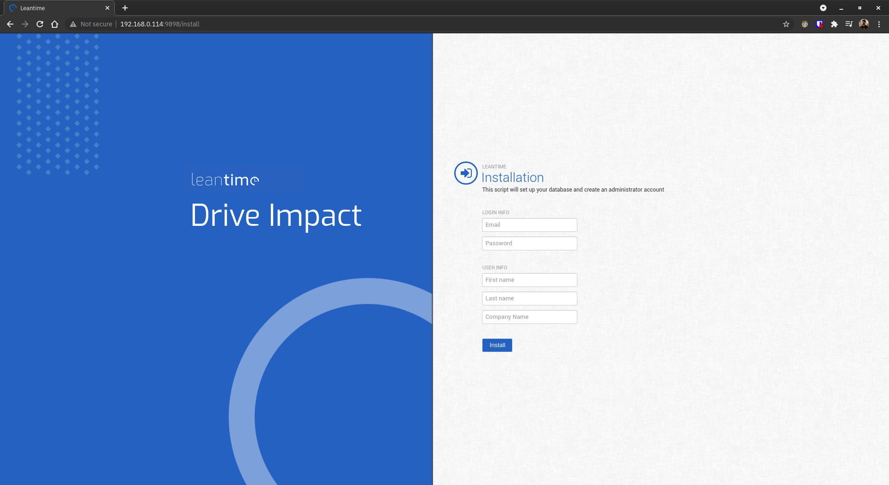

# Setting up Leantime Docker on CentOS host

> Reference : https://hub.docker.com/r/leantime/leantime

1. Clone the repo to your local storage and make the `setting-up-leantime-docker-on-centos-host` directory your current working directory.
2. Make changes to `prepbook.yml` according to your preferences to reflect the changes in `hostaddr`, `username`, `servlist`, `database_port`, `leantime_port`, `database_hostname`, `leantime_hostname`, `database_name`, `database_user`, `database_rootpass`, `database_userpass` and `ntwkname` variables.
3. Once done, execute the following command to populate the primary playbook and inventory file.
    ```
    ansible-playbook prepbook.yml -vvv
    ```
4. Fetch the `community.docker` collection from Ansible Galaxy by executing the following command.
    ```
    ansible-galaxy collection install community.docker
    ```
5. Two new files would be generated as a result, so execute the following command to actually start setting up Leantime Docker.
    ```
    ansible-playbook -i register.ini trapplay.yml -vvv
    ```
6. Once the containers are configured and started, open up `http://<ansible_host>:<leantime_port>/install` (or `http://192.168.0.114:9898/install` if nothing was changed) using a web browser of your choice on a device connected to the same network as that of the server.
7. Fill out the form as shown below to create your first user.
    
8. Log in using the credentials provided in the form to get started with using Leantime.