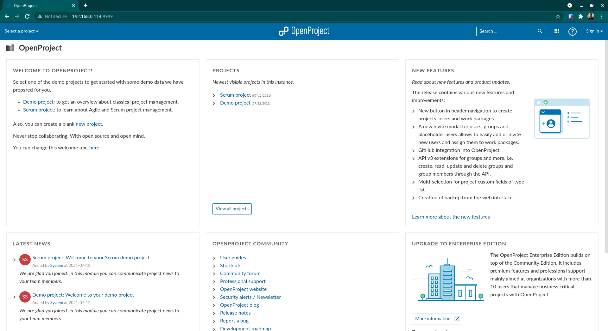

# Setting up OpenProject Docker on CentOS host

> Reference : https://www.openproject.org/docs/installation-and-operations/installation/docker/

1. Clone the repo to your local storage and make the `setting-up-openproject-docker-on-centos-host` directory your current working directory.
2. Make changes to `prepbook.yml` according to your preferences to reflect the changes in `hostaddr`, `username`, `servlist`, `openpjct_pgdata`, `openpjct_assets`, `openpjct_hostname`, `openpjct_port` and `passhash` variables.
3. One way to generate the value for the `passhash` variable is to run the following if you are on a GNU/Linux distribution.
    ```
    head /dev/urandom | tr -dc A-Za-z0-9 | head -c 32 ; echo ''
    ```
4. Once done, execute the following command to populate the primary playbook and inventory file.
    ```
    ansible-playbook prepbook.yml -vvv
    ```
5. Fetch the `community.docker` collection from Ansible Galaxy by executing the following command.
    ```
    ansible-galaxy collection install community.docker
    ```
6. Two new files would be generated as a result, so execute the following command to actually start setting up OpenProject Docker.
    ```
    ansible-playbook -i register.ini trapplay.yml -vvv
    ```
7. Once the container is configured and started, open up `http://<ansible_host>:<openpjct_port>/` (or `http://192.168.0.114:9999/` if nothing was changed) using a web browser of your choice on a device connected to the same network as that of the server.
8. Fill out the form as shown below to create your first user.
    
9. Log in using the credentials provided in the form to get started with using OpenProject.